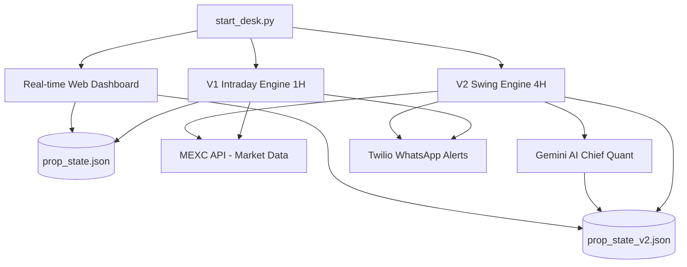

# 🦅 Apex-Q Prop Trader Swarm

Apex-Q is a state-of-the-art, multi-agent algorithmic prop trading framework. It combines high-frequency technical indicators, macro sentiment analysis via Gemini AI, real-time alert notifications (WhatsApp via Twilio), and an interactive web dashboard for real-time tracking.

The system runs a **Dual-Engine Swarm** designed to exploit high-probability setups while systematically checking for macro risk:
1. **V1 (Intraday Engine):** Scans 1-Hour charts looking for steady 3-6% intraday swing structures.
2. **V2 (Macro Swing Engine):** Scans 4-Hour charts targetting 8-15% macro swings, utilizing advanced Premium/Discount structure mapping.

---

## 📐 System Architecture



---

## 🌟 Core Features

### 1. Dual-Engine Timeframe Swarm
- **Intraday Bot (V1):** Scans the top 20 assets on the 1-Hour timeframe utilizing Trend Reclaims and Liquidity Sweeps.
- **Swing Bot (V2):** Operates on the 4-Hour timeframe. Focuses on larger macroeconomic swing setups.

### 2. Gemini AI Chief Quantitative Strategist Override
Every 4 hours, the system generates a comprehensive **State Payload** (Account Equity, Drawdown, Whale Long/Short Ratio, Funding Rates, USD Macro News, Fear & Greed index). This payload is analyzed by Gemini AI to dictate firm-wide parameters:
- **Cash Preservation Override:** If high-impact USD macro news or volatile sentiments are present, the strategist pauses trading (`HOLD_CASH`).
- **Dynamic Risk Adjustment:** Automatically increases/decreases trading risk (0.10% to 0.35%) based on drawdown and firm performance.
- **Directional Bias:** Declares `LONG_ONLY`, `SHORT_ONLY`, or `NEUTRAL` modes.

### 3. Dynamic Boot-up & Power Down Recovery
If the server, program, or host computer goes to sleep or gets powered off, the engines run a **historical recovery scan** immediately on the next boot. It queries the historical candlesticks from the exact entry time of each open trade up to the current moment. 
If targets were hit during the offline period, the trades are retroactively resolved, the equity is calculated, and the Automated Shadow Ledger is updated with the exact historical timestamp of the resolution.

### 4. Real-time Live Web Dashboard
An interactive dashboard displaying:
- Core metrics (Active Equity, Drawdown, Profit/Loss, High Water Mark).
- Current Strategist Directives (Regime, Bias, Risk Levels, Strategic Reasoning).
- Active Open Trades (Asset, Entry, Stop Loss, Take Profit, Live PnL).
- Closed Trade History (Shadow Ledger) with exact timestamps and performance results.

---

## 🛠️ Getting Started & Setup

### 1. Prerequisites
- **Python 3.8+** installed.
- Access to **MEXC Contract API** (No keys required for public endpoints).

### 2. Obtain External API Credentials
To utilize the full capabilities, you need credentials for the following services:
- **Gemini Developer API:** For the quantitative reasoning engine. [Get Gemini API Key](https://ai.google.dev/)
- **Twilio Account:** For sending WhatsApp alerts. [Sign Up for Twilio](https://www.twilio.com/)
- **TwelveData API:** For index/stock proxy data. [Get TwelveData Key](https://twelvedata.com/)
- **Coinalyze API:** For crypto sentiment and funding rates. [Get Coinalyze Key](https://coinalyze.net/)
- **CoinDesk API:** For blockchain sentiment indexes.

### 3. Configure the Environment
Clone the repository, navigate to the folder, and create your `.env` configuration file from the template:

```bash
cp .env.example .env
```

Open `.env` and fill in your API tokens:

```ini
# Twilio Alerts Configuration
TWILIO_ACCOUNT_SID=AC...your_twilio_sid...
TWILIO_AUTH_TOKEN=your_twilio_auth_token
TWILIO_WHATSAPP_FROM=whatsapp:+14155238886 # Twilio sandbox or sender number
USER_WHATSAPP_TO=whatsapp:+your_phone_number # Destination phone number with country code

# Gemini AI Configuration
GEMINI_API_KEY=AIzaSy...your_gemini_key...

# Market Data Providers
TWELVEDATA_API_KEY=your_twelvedata_api_key
COINALYZE_API_KEY=your_coinalyze_api_key
COINDESK_API_KEY=your_coindesk_api_key
```

### 4. Running the Backtest Suite
Before running live, you can simulate strategies against the last 1000 candles of major assets:

```bash
python3 scripts/backtester.py
```

### 5. Running the Live Desk
To start the V1 Engine, V2 Engine, and the Web Dashboard concurrently, execute the main starter script:

```bash
python3 scripts/start_desk.py
```

- To monitor the live metrics, open `http://localhost:5000` (or the port outputted by the console) in your web browser.
- Press `Ctrl+C` to terminate the swarm safely.

---

## 📂 Project Structure

```
├── .env.example               # Config template file
├── .gitignore                 # Excludes local states/caches and secrets
├── README.md                  # System Documentation
└── scripts/
    ├── start_desk.py          # Swarm Orchestrator (bootloader)
    ├── trader_v1.py           # 1-Hour Intraday Trading Engine
    ├── trader_v2.py           # 4-Hour Macro Swing Trading Engine
    ├── twilio_alert.py        # WhatsApp Alert Dispatcher
    ├── apex_web_dashboard_new.py # Web Dashboard Server
    ├── backtester.py          # Strategy Backtesting Engine
    ├── prop_state.json        # Active V1 State (recreated at boot)
    └── prop_state_v2.json      # Active V2 State (recreated at boot)
```

---

## ⚠️ Disclaimer
This software is for educational and research purposes only. Do not use this tool for live trading without thorough individual risk evaluation and code verification. Algorithmic trading carries a significant risk of capital loss.
